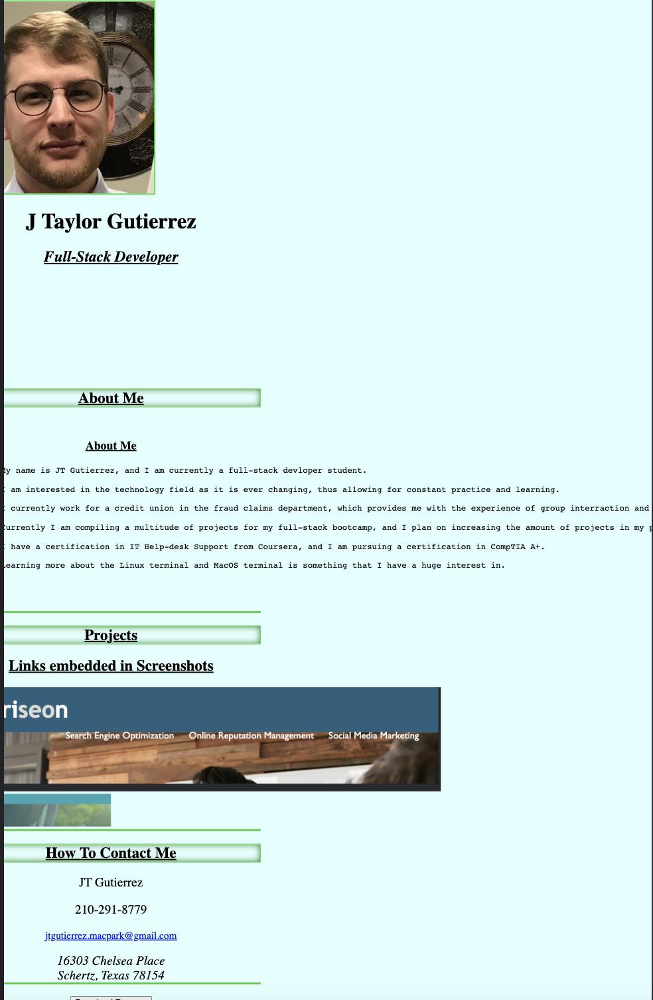

# professional-portfolio

## Challenge 2

This challenge consisted of making a portfolio page that future employers and coworkers will look at.

This project will follow us throughout the duration of our 6 month bootcamp.

I plan on updating this project during the bootcamp to help illustrate new projects as well as different techniques to style
and organize a professional webpage.

[Professional-portfolio] (https://wumbo-dot.github.io/professional-portfolio/)

Add
